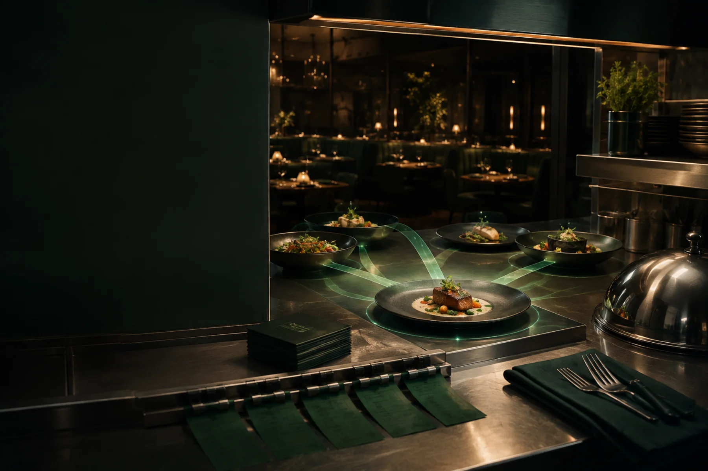

# Kutlerri.ai

An outcome-driven website for Kutlerri's restaurant AI agents. The experience focuses on the three results operators care about: growing revenue, protecting margins, and expanding with evidence.

[View the live website](https://vrajnotviraj.github.io/kutlerri/)



## Highlights

- Restaurant-first visual storytelling and measurable profit outcomes
- Responsive layouts for desktop and mobile
- Accessible navigation, focus states, reduced-motion support, and semantic content
- Progressive GSAP scroll motion with graceful static fallbacks
- Optimized WebP imagery with high-resolution source assets
- Zero-dependency static deployment

## Run locally

The project does not require a package installation step.

```bash
node src/build.js
python3 -m http.server 4173
```

Then open [http://localhost:4173](http://localhost:4173).

## Project structure

```text
src/       Shared layout, page content, styles, behavior, and build script
public/    Fonts and visual assets
*.html     Generated, deployment-ready pages
```

Edit files in `src/`, then run `node src/build.js` to regenerate the root HTML pages. Commit both the source and generated output so the published site always matches the repository.

## Deployment

GitHub Pages publishes the root of the `main` branch. A `.nojekyll` file keeps the output on GitHub's direct static-file path.

